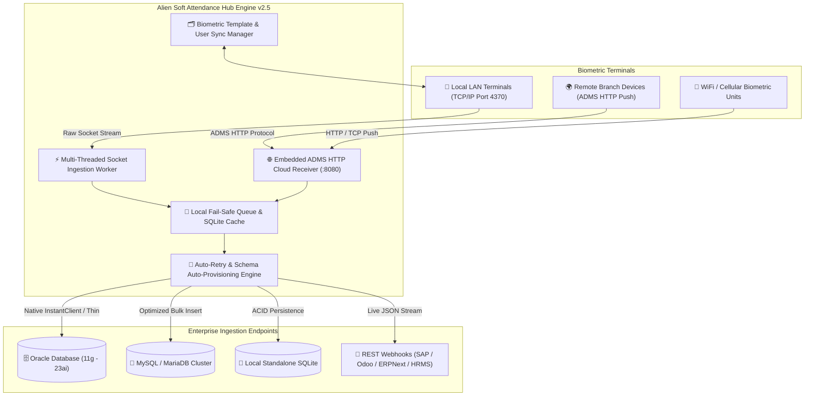

<div align="center">

# 🌐 Alien Soft ZKTeco Attendance Hub Enterprise
### **Carrier-Grade Biometric Synchronization & Multi-Database Ingestion Platform**

[](https://github.com/sohaghaing0070/AlienZKTecoSync/releases/tag/v2.5.0)
[](https://github.com/sohaghaing0070/AlienZKTecoSync)
[](https://github.com/sohaghaing0070/AlienZKTecoSync)
[](https://github.com/sohaghaing0070/AlienZKTecoSync)
[](https://github.com/sohaghaing0070/AlienZKTecoSync)

<br/>

**Alien Soft ZKTeco Attendance Hub Enterprise** is a high-performance Windows desktop application and resilient background synchronization service engineered for real-time, automated biometric log ingestion between **ZKTeco biometric terminals** and **Enterprise Databases (Oracle, MySQL, SQLite, REST Webhooks, and ERP/HRMS systems)**.

<br/>

[📥 Download Installer (.exe)](https://github.com/sohaghaing0070/AlienZKTecoSync/releases/download/v2.5.0/AlienZKTecoSync_v2.5_Setup.exe) • [📦 Download Portable (.zip)](https://github.com/sohaghaing0070/AlienZKTecoSync/releases/download/v2.5.0/AlienZKTecoSync_v2.5_Portable.zip) • [💬 WhatsApp Direct Support](https://wa.me/8801710978997) • [🌐 Official Website](https://aliensoftwaredevelopment.com)

---

</div>

## 📑 Table of Contents
- [Executive Overview](#-executive-overview)
- [System Architecture](#-system-architecture)
- [Feature Matrix: Standard vs Alien Soft Enterprise](#-feature-matrix-standard-vs-alien-soft-enterprise)
- [Core Capabilities & Engineering Highlights](#-core-capabilities--engineering-highlights)
  - [1. Multi-Protocol Hardware Communication](#1-multi-protocol-hardware-communication)
  - [2. Built-in ADMS Cloud Push Gateway](#2-built-in-adms-cloud-push-gateway)
  - [3. Multi-Database Engine & Schema Auto-Detection](#3-multi-database-engine--schema-auto-detection)
  - [4. REST API & Webhook Dispatcher with Offline Queue](#4-rest-api--webhook-dispatcher-with-offline-queue)
  - [5. Full Biometric Template & Employee Management](#5-full-biometric-template--employee-management)
  - [6. Automated Hot Backups & Retention Manager](#6-automated-hot-backups--retention-manager)
  - [7. Silent Background Service & Tray Monitoring](#7-silent-background-service--tray-monitoring)
- [Hardware & Firmware Compatibility Matrix](#-hardware--firmware-compatibility-matrix)
- [Database Specifications & Connectivity Modes](#-database-specifications--connectivity-modes)
- [Webhook JSON Payload Specification](#-webhook-json-payload-specification)
- [Deployment & Quick Start Guide](#-deployment--quick-start-guide)
- [Enterprise Data Privacy & Security](#-enterprise-data-privacy--security)
- [Official Release Downloads](#-official-release-downloads)
- [Developer & Enterprise Support](#-developer--enterprise-support)

---

## 🎯 Executive Overview

Organizations managing workforce attendance across multi-branch or high-throughput environments frequently experience:
- Data bottlenecks and dropped punch logs during peak shift hours.
- Complexity bridging proprietary device protocols with enterprise databases like Oracle and MySQL.
- Network fragility when sync servers drop connections across WAN/VPN links.

**Alien Soft ZKTeco Attendance Hub Enterprise** completely eliminates these challenges by providing a robust, standalone ingestion pipeline with live socket streaming, ADMS push listening, automated database schema mapping, and fail-safe local caching.

---

## 🏗️ System Architecture



---

## 📊 Feature Matrix: Standard vs Alien Soft Enterprise

| Feature / Capability | Standard ZKTeco Utilities | Alien Soft Enterprise Hub v2.5 |
| :--- | :---: | :---: |
| **Real-time Live Punch Capture** | ❌ Polling Only | ✅ Instant Millisecond Stream |
| **ADMS Multi-Branch Cloud Receiver** | ❌ Requires Cloud Subscription | ✅ Integrated On-Premises Server |
| **Native Oracle DB (11g - 23ai)** | ❌ Unsupported | ✅ Full Native Thin & Thick Support |
| **Direct MySQL / MariaDB Ingestion** | ⚠️ Complex ODBC Setup | ✅ Native Socket Bulk Insert |
| **REST Webhooks & Cloud ERP Dispatch** | ❌ Unsupported | ✅ Built-in with Offline Retry Queue |
| **Biometric Template Migration** | ⚠️ Manual Export/Import | ✅ One-Click Device-to-Device Sync |
| **Automated Scheduled Database Backups** | ❌ None | ✅ Hot Daily/Weekly Rotation Manager |
| **Silent Windows Boot Service** | ❌ GUI Required | ✅ Silent Background Tray & Boot Hook |
| **Installation Dependencies** | ⚠️ Python / VC++ / Runtimes | ✅ 100% Offline Single Binary |

---

## 🌟 Core Capabilities & Engineering Highlights

### 1. Multi-Protocol Hardware Communication
* **Direct Standalone Socket Engine:** Direct TCP/IP and UDP packet communication over port `4370` with configurable `CommKey` verification.
* **Live Event Stream Listener:** Captures punch events the millisecond an employee scans their finger, RFID badge, or face without waiting for polling intervals.
* **Resilient Auto-Polling Worker:** Background worker thread monitors device buffer with automated exponential backoff, socket recreation, and zero CPU starvation.

### 2. Built-in ADMS Cloud Push Gateway
* **Embedded HTTP Listener:** High-throughput HTTP server receiving pushed attendance records from remote branch terminals over WAN, dynamic DNS, or NAT firewalls.
* **Full Protocol Compatibility:** Supports standard ZKTeco ADMS lifecycle commands (`cdata`, `registry`, `options`, `query`).

### 3. Multi-Database Engine & Schema Auto-Detection
* **Oracle Database Ingestion:** Powered by `python-oracledb` supporting both **Thin mode** (driverless zero-configuration) and **Thick mode** (Oracle Instant Client 11g through 23ai).
* **MySQL & MariaDB:** High-speed bulk insertion algorithms with automatic deduplication.
* **Embedded SQLite Storage:** Local standalone storage providing offline reliability and data safety.
* **Automatic Schema Provisioning:** Automatically detects target database schemas, creates missing attendance tables, and maps punch columns seamlessly.

### 4. REST API & Webhook Dispatcher with Offline Queue
* **Enterprise ERP Delivery:** Streams attendance punches as formatted JSON payloads to SAP, Odoo, Oracle ERP, ERPNext, Laravel, Node.js, and custom REST API endpoints.
* **Persistent Fail-Safe Queue:** If target webhooks or network links are temporarily unavailable, punches are queued in local SQLite storage and retried automatically.

### 5. Full Biometric Template & Employee Management
* **Device User Management:** Upload, download, edit, and deactivate employee profiles directly from the centralized dashboard.
* **Biometric Template Backup & Sync:** Backup and clone fingerprint templates (ZKFinger V10.0 / V9.0) and facial recognition data across multiple terminals.
* **Hardware RTC Clock Synchronization:** Synchronizes terminal hardware clocks with the Windows host or network NTP server.

### 6. Automated Hot Backups & Retention Manager
* **Zero-Downtime Hot Backups:** Scheduled automatic database backups (Daily, Weekly, Monthly) without interrupting active sync streams.
* **Configurable Retention Policy:** Automatic rotation and cleanup of old backup archives to prevent disk exhaustion.

### 7. Silent Background Service & Tray Monitoring
* **Windows System Tray Minimized Mode:** Runs discreetly in the Windows Notification Area with full status indicators and quick-action menu controls (`Open`, `Pause`, `Sync Now`, `Exit`).
* **Silent Boot Auto-Start:** Integrated Windows startup registry hooks allow silent execution at system power-on without opening console windows.

---

## 📱 Hardware & Firmware Compatibility Matrix

Certified across major ZKTeco terminal families:

| Series | Model Examples | Protocols | Biometric Modalities |
| :--- | :--- | :---: | :--- |
| **K-Series** | K40, K20, K50, K60, K90 | Standalone (TCP/UDP) | Fingerprint, RFID Card, PIN |
| **iClock Series** | iClock 260, 360, 580, 880 | Standalone / ADMS | Fingerprint, RFID Card, PIN |
| **uFace / Silk Series** | uFace 800, SilkBio-100TC | Standalone / ADMS | Face ID, Fingerprint, RFID, PIN |
| **IN / MB Series** | IN01, MB20, MB160, MB360 | Standalone / ADMS | Fingerprint, Face, RFID Card |
| **SpeedFace Series** | SpeedFace V5L, ProFace X | ADMS / Push HTTP | Visible Light Face, Palm, Card |

---

## 🗄️ Database Specifications & Connectivity Modes

```
┌─────────────────┬──────────────────────────────────────┬───────────────────────────────┐
│ Database Engine │ Supported Versions                   │ Connectivity Mode             │
├─────────────────┼──────────────────────────────────────┼───────────────────────────────┤
│ Oracle DB       │ 11g R2, 12c, 18c, 19c, 21c, 23ai     │ Thin (Driverless) & Thick     │
│ MySQL           │ 5.7, 8.0, 8.4 LTS                    │ Native TCP Socket (PyMySQL)   │
│ MariaDB         │ 10.3 to 11.x                         │ Native TCP Socket             │
│ SQLite          │ 3.x                                  │ Embedded ACID Compliant       │
│ REST Webhook    │ Any HTTP/HTTPS REST Endpoint         │ Real-time JSON Payload Stream │
└─────────────────┴──────────────────────────────────────┴───────────────────────────────┘
```

---

## 📡 Webhook JSON Payload Specification

When Webhooks are active, punch events are dispatched in real time:

```json
{
  "event": "attendance_punch",
  "device_ip": "192.168.1.201",
  "device_name": "Main Entrance Terminal",
  "user_id": "10042",
  "punch_time": "2026-09-27 08:30:15",
  "punch_state": "Check-In",
  "verify_type": "Fingerprint",
  "timestamp": 1790488215
}
```

---

## 🚀 Deployment & Quick Start Guide

### Step 1: Install or Extract
* **Using Setup Wizard:** Run [`AlienZKTecoSync_v2.5_Setup.exe`](https://github.com/sohaghaing0070/AlienZKTecoSync/releases/download/v2.5.0/AlienZKTecoSync_v2.5_Setup.exe) and follow the on-screen installer.
* **Using Portable Zip:** Extract [`AlienZKTecoSync_v2.5_Portable.zip`](https://github.com/sohaghaing0070/AlienZKTecoSync/releases/download/v2.5.0/AlienZKTecoSync_v2.5_Portable.zip) and launch `Launch_AlienZKTecoSync.bat`.

### Step 2: Configure Terminal
1. Open the **ZKTeco Settings** tab.
2. Enter your Terminal IP Address (e.g., `192.168.1.201`) and Port `4370`.
3. Click **Test Connection** to verify socket connectivity.

### Step 3: Configure Database & Start
1. Open the **Database Config** tab and select your destination database (Oracle, MySQL, or SQLite).
2. Enter your database connection credentials and click **Test DB Connection**.
3. Click **Start Sync Engine**. The status indicator turns green, and real-time punch logs appear immediately in the activity feed.

---

## 🛡️ Enterprise Data Privacy & Security

- **100% On-Premises Isolated Execution:** Operates entirely within your private corporate network without any dependency on third-party cloud servers.
- **Zero Data Leakage & Zero Telemetry:** Biometric logs, employee records, and database credentials remain strictly inside your organization's secure infrastructure.
- **Local Secure Storage:** Database profiles and system configurations are maintained locally in ACID-compliant encrypted storage.
- **Administrative Access Control:** Built-in management authentication protects sync configurations, device mappings, and database settings from unauthorized modification.

---

## 📥 Official Release Downloads

All packages are pre-compiled native Windows binaries (universal 32-bit and 64-bit compatibility):

| Package Name | Architecture | File Size | Description | Download |
| :--- | :---: | :---: | :--- | :---: |
| **Setup Wizard Installer** | `x86 / x64` | `41.5 MB` | One-click offline installer with desktop & start menu shortcuts | [⬇️ Download .exe](https://github.com/sohaghaing0070/AlienZKTecoSync/releases/download/v2.5.0/AlienZKTecoSync_v2.5_Setup.exe) |
| **Portable Release Package** | `x86 / x64` | `29.0 MB` | Standalone portable archive (extract and run) | [⬇️ Download .zip](https://github.com/sohaghaing0070/AlienZKTecoSync/releases/download/v2.5.0/AlienZKTecoSync_v2.5_Portable.zip) |

---

## 👨‍💻 Developer & Enterprise Support

For custom database integrations, source code licensing, OEM white-labeling, or technical support:

<div align="center">

### **Alien Software Development**
*Specialized in Enterprise Biometrics, Automation & Custom System Solutions*

**Lead Developer & Proprietor:** Md Sumon Islam Sohag  
📍 **Location:** Dhaka, Bangladesh  
💬 **WhatsApp:** [**+8801710978997**](https://wa.me/8801710978997)  
🌐 **Website:** [**https://aliensoftwaredevelopment.com**](https://aliensoftwaredevelopment.com)  
🐙 **GitHub:** [**@sohaghaing0070**](https://github.com/sohaghaing0070)

---

⭐ **Star this repository** if you find this project valuable!

</div>
