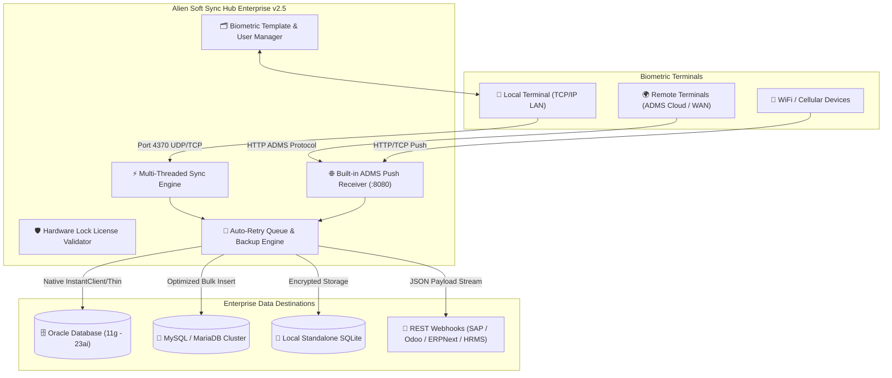

<div align="center">

# 🌐 Alien Soft ZKTeco Attendance Hub Enterprise
### **Next-Generation Standalone & ADMS Biometric Synchronization Platform**

[](https://github.com/sohaghaing0070/AlienZKTecoSync/releases/tag/v2.5.0)
[](https://github.com/sohaghaing0070/AlienZKTecoSync)
[](https://github.com/sohaghaing0070/AlienZKTecoSync)
[](https://github.com/sohaghaing0070/AlienZKTecoSync)
[](https://github.com/sohaghaing0070/AlienZKTecoSync)

<br/>

**Alien Soft ZKTeco Attendance Hub Enterprise** is a carrier-grade Windows desktop synchronization engine and background service designed for seamless, automated, and real-time attendance ingestion from **ZKTeco biometric terminals** into enterprise ERPs, HRMS platforms, and relational databases.

[📥 Download Installer](https://github.com/sohaghaing0070/AlienZKTecoSync/releases/download/v2.5.0/AlienZKTecoSync_v2.5_Setup.exe) • [📦 Download Portable (.zip)](https://github.com/sohaghaing0070/AlienZKTecoSync/releases/download/v2.5.0/AlienZKTecoSync_v2.5_Portable.zip) • [💬 WhatsApp Support](https://wa.me/8801710978997) • [🌐 Official Website](https://aliensoftwaredevelopment.com)

---

</div>

## 📑 Table of Contents
- [System Architecture](#-system-architecture)
- [Download Official Releases](#-download-official-releases)
- [Key Highlights & Core Capabilities](#-key-highlights--core-capabilities)
- [Device & Firmware Compatibility](#-device--firmware-compatibility)
- [Supported Database Engines](#-supported-database-engines)
- [Real-Time Webhook & ERP Integration](#-real-time-webhook--erp-integration)
- [Installation & Quick Start](#-installation--quick-start)
- [Enterprise Data Privacy & Security](#-enterprise-data-privacy--security)
- [Developer & Enterprise Support](#-developer--enterprise-support)

---

## 🏗️ System Architecture



---

## 📥 Download Official Releases

All client packages are **100% pre-compiled native binaries**. No Python environment, pip packages, or Visual C++ redistributables are required.

| Package | Format | File Size | Recommended For | Direct Link |
| :--- | :---: | :---: | :--- | :--- |
| **Setup Installer** | `.exe` | `41.5 MB` | Standard deployment, Desktop & Start Menu shortcuts, Control Panel uninstaller | [⬇️ Download Installer](https://github.com/sohaghaing0070/AlienZKTecoSync/releases/download/v2.5.0/AlienZKTecoSync_v2.5_Setup.exe) |
| **Portable Package** | `.zip` | `29.0 MB` | Flash drives, portable usage, server environments with restricted installation rights | [⬇️ Download Portable](https://github.com/sohaghaing0070/AlienZKTecoSync/releases/download/v2.5.0/AlienZKTecoSync_v2.5_Portable.zip) |

---

## 🌟 Key Highlights & Core Capabilities

### 1. ⏱️ Dual-Mode Biometric Communication Engine
- **Direct Standalone Protocol:** Connects directly to ZKTeco hardware via standard port `4370` using high-performance TCP/IP and UDP packets with configurable `CommKey` security.
- **Live Event Capture Stream:** Intercepts punch events instantly the millisecond an employee scans their fingerprint, card, or face.
- **Background Auto-Polling:** Automated non-blocking thread polls device memory at configurable intervals (1 second to 1 hour) with automatic socket reconnect and network recovery.

### 2. 🌐 Integrated ADMS / Cloud Push Receiver
- **Built-in HTTP Push Gateway:** Runs an embedded high-throughput HTTP server receiving attendance logs pushed from remote devices across multiple branch offices or behind NAT firewalls.
- **Standard Protocol Handshake:** Fully compliant with ZKTeco ADMS protocols including `cdata`, `registry`, `options`, and `query` operations.

### 3. 🗄️ Multi-Database Enterprise Connectors
- **Oracle Database (11g, 12c, 18c, 19c, 21c, 23ai):** Powered by `python-oracledb` supporting both Thin mode (driverless) and Thick mode (Oracle Instant Client).
- **MySQL & MariaDB:** High-speed bulk insertion with duplicate check algorithms.
- **SQLite Embedded DB:** High-reliability local persistence for offline logging and cache storage.
- **Auto Table & Column Detection:** Automatically verifies, provisions, and maps target database schemas if tables do not exist.

### 4. 📡 Real-Time Webhooks & ERP Bridge
- **RESTful JSON Dispatcher:** Automatically delivers structured JSON attendance payloads to external webhooks and REST API endpoints.
- **Fail-Safe Offline Queue:** If your remote server or cloud ERP is down, punches are queued in SQLite storage and retried automatically with exponential backoff.

### 5. 👥 Comprehensive Biometric Template & User Management
- **Biometric Backup & Migration:** Download and migrate fingerprint templates (ZKFinger V10.0 & V9.0) and facial recognition data between devices.
- **User Record Sync:** Push employee names, IDs, privileges (User / Admin), passwords, and RFID card numbers directly to terminals.
- **Terminal Clock Synchronization:** Automatically syncs hardware RTC clocks with Windows time or network NTP servers.

### 6. 🔄 Zero-Interruption Background Service
- **System Tray Minimization:** Sits silently in the Windows system tray with quick action controls (`Open Dashboard`, `Sync Now`, `Pause`, `Exit`).
- **Silent Boot Auto-Start:** Integrated Windows startup registry hooks allow silent execution at system power-on without requiring user login or opening command-line windows.

---

## 📱 Device & Firmware Compatibility

Tested and certified across popular ZKTeco hardware series:

| Series | Model Examples | Protocols | Biometric Modalities |
| :--- | :--- | :---: | :--- |
| **K-Series** | K40, K20, K50, K60, K90 | Standalone (TCP/UDP) | Fingerprint, RFID Card, PIN |
| **iClock Series** | iClock 260, 360, 580, 880 | Standalone / ADMS | Fingerprint, Card, PIN |
| **uFace / Silk Series** | uFace 800, SilkBio-100TC | Standalone / ADMS | Face, Fingerprint, RFID, PIN |
| **IN / MB Series** | IN01, MB20, MB160, MB360 | Standalone / ADMS | Fingerprint, Face ID, Card |
| **SpeedFace Series** | SpeedFace V5L, ProFace X | ADMS / Push HTTP | Visible Light Face, Palm, Card |

---

## 🗄️ Supported Database Engines

```
┌─────────────────┬──────────────────────────────────────┬───────────────────────────────┐
│ Database Engine │ Supported Versions                   │ Connectivity Mode             │
├─────────────────┼──────────────────────────────────────┼───────────────────────────────┤
│ Oracle DB       │ 11g R2, 12c, 18c, 19c, 21c, 23ai     │ Thin (Driverless) & Thick     │
│ MySQL           │ 5.7, 8.0, 8.4 LTS                    │ Native TCP Socket (PyMySQL)   │
│ MariaDB         │ 10.3 to 11.x                         │ Native TCP Socket             │
│ SQLite          │ 3.x                                  │ Embedded ACID Compliant       │
│ REST API        │ Any HTTP/HTTPS Webhook Endpoint      │ Real-time JSON Payload Post   │
└─────────────────┴──────────────────────────────────────┴───────────────────────────────┘
```

---

## 📡 Webhook JSON Payload Schema

When Webhooks are enabled, the engine dispatches real-time JSON payloads:

```json
{
  "event": "attendance_punch",
  "device_ip": "192.168.1.201",
  "device_name": "Main Entrance Terminal",
  "user_id": "10042",
  "punch_time": "2026-09-27 08:30:15",
  "punch_state": "Check-In",
  "verify_type": "Fingerprint",
  "timestamp": 1790488215
}
```

---

## 🚀 Installation & Quick Start

### 1. Installation Wizard
1. Download [`AlienZKTecoSync_v2.5_Setup.exe`](https://github.com/sohaghaing0070/AlienZKTecoSync/releases/download/v2.5.0/AlienZKTecoSync_v2.5_Setup.exe).
2. Double-click the installer and follow the on-screen Setup Wizard.
3. Launch from the created **Desktop Shortcut** or **Start Menu**.

### 2. Initial Setup in 3 Simple Steps
1. **Connect Terminal:** Navigate to the **ZKTeco Settings** tab, enter the Device IP (e.g. `192.168.1.201`), Port `4370`, and click **Test Connection**.
2. **Configure Database:** In the **Database Config** tab, select your database engine (Oracle / MySQL / SQLite), enter your server credentials, and test the link.
3. **Start Sync:** Click **Start Sync Engine**. The status indicator turns green, and real-time punch logs appear immediately in the activity feed.

## 🛡️ Enterprise Data Privacy & Security

- **100% On-Premises Isolated Execution:** Operates entirely within your private corporate network without any dependency on third-party cloud servers.
- **Zero Data Leakage & Zero Telemetry:** Biometric logs, employee records, and database credentials remain strictly inside your organization's secure infrastructure.
- **Local Secure Storage:** Database profiles and system configurations are maintained locally in ACID-compliant encrypted storage.
- **Administrative Access Control:** Built-in management authentication protects sync configurations, device mappings, and database settings from unauthorized modification.


---

## 👨‍💻 Developer & Enterprise Commercial Licensing

For custom database integrations, source code licensing, OEM white-labeling, or technical support:

<div align="center">

### **Alien Software Development**
*Specialized in Enterprise Biometrics, Automation & Custom System Solutions*

**Lead Developer & Proprietor:** Md Sumon Islam Sohag  
📍 **Location:** Dhaka, Bangladesh  
💬 **WhatsApp:** [**+8801710978997**](https://wa.me/8801710978997)  
🌐 **Website:** [**https://aliensoftwaredevelopment.com**](https://aliensoftwaredevelopment.com)  
🐙 **GitHub:** [**@sohaghaing0070**](https://github.com/sohaghaing0070)

---

⭐ **Star this repository** if you find it helpful!

</div>
